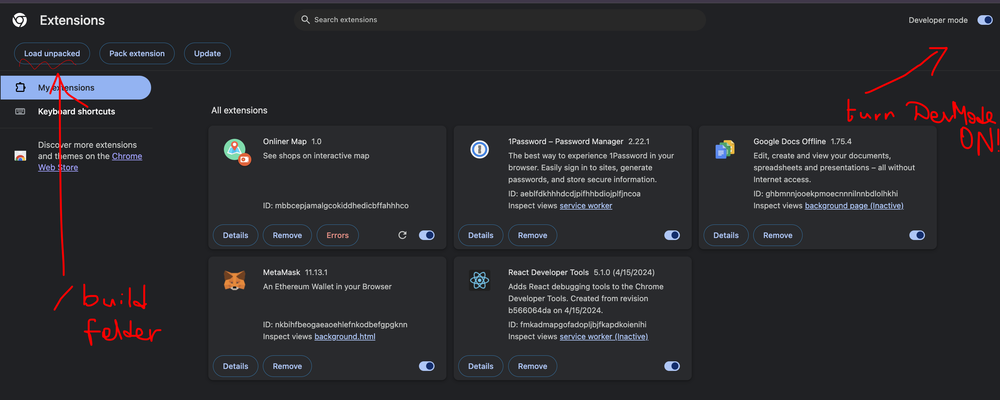
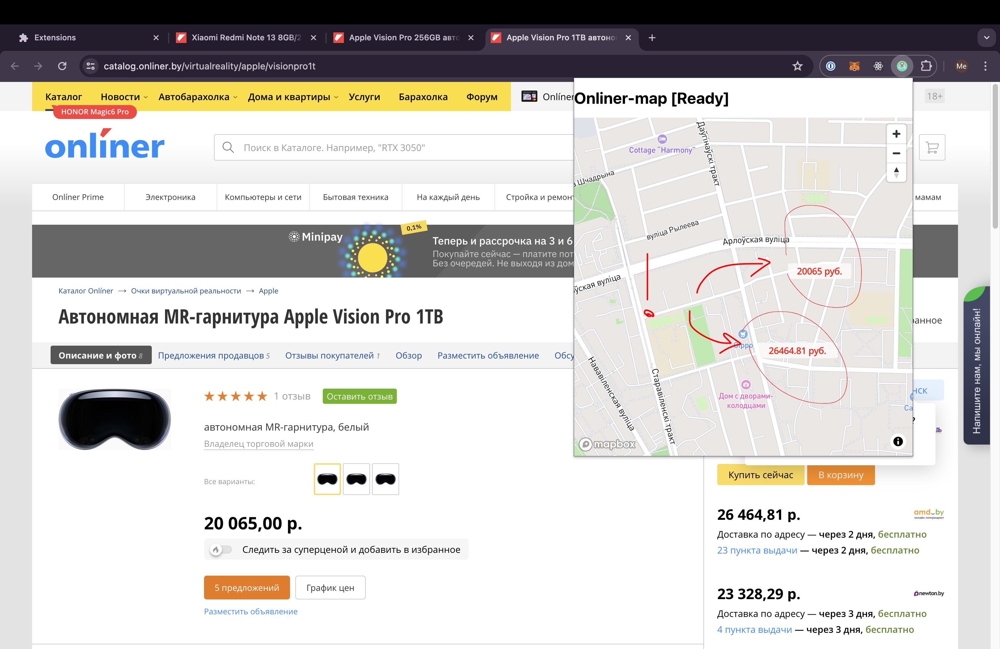

# Onliner-map

## Building

- ### `cat REACT_APP_MAPBOX_TOKEN=<your mapbox api key> .env `
  
  Example:
  
  ### `cat REACT_APP_MAPBOX_TOKEN=pk.eyJ1IddW94536ifQ.xAHiLx6T46573nNVMTgNg .env`

- ### `npm install`

- ### `npm run build`

Builds the app for production to the `build` folder

The build is minified and the filenames include the hashes.

